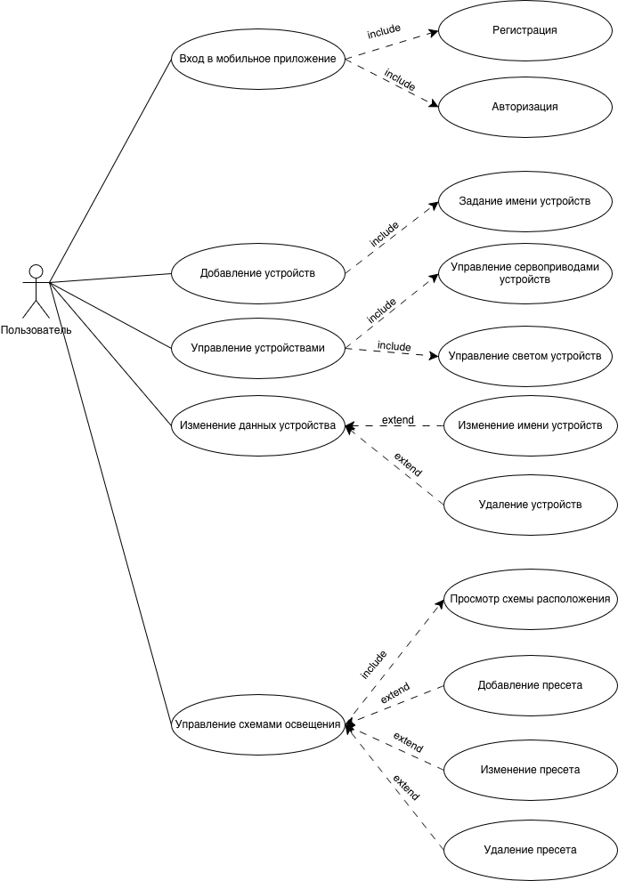
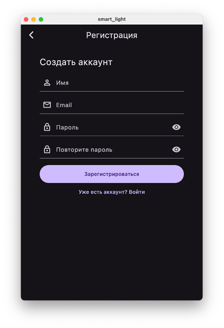
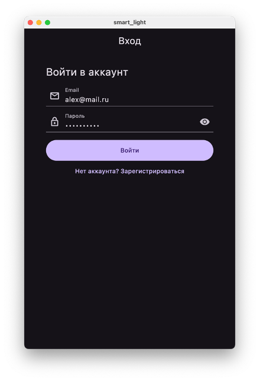
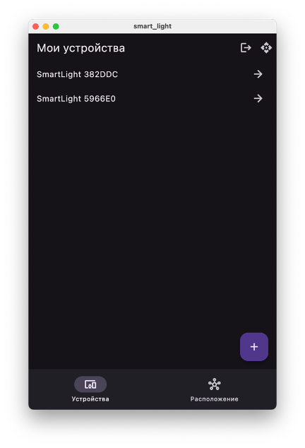
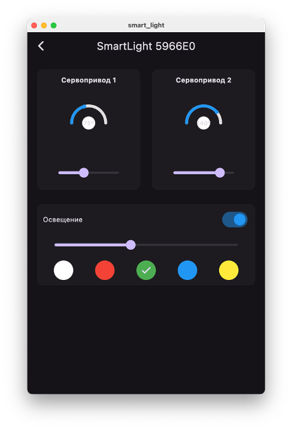
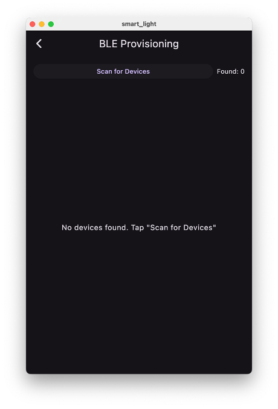
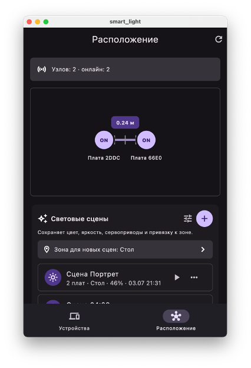
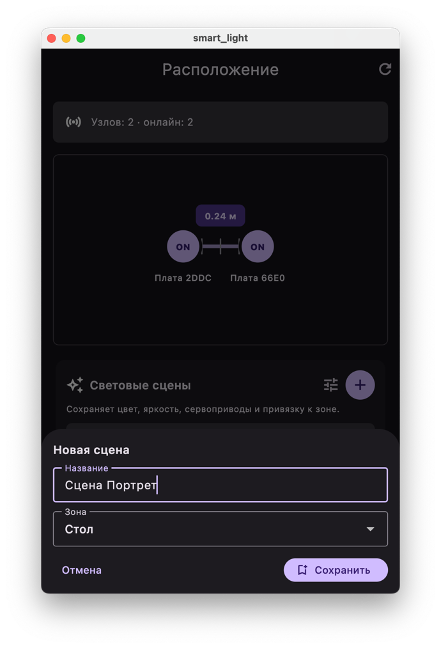

# Smart Light

Smart Light — монорепозиторий системы умного освещения с ESP32-устройствами,
UWB-позиционированием, backend на Nitro и мобильным приложением на Flutter.
Система позволяет управлять светодиодами и сервоприводами, объединять устройства
в зоны, сохранять световые сцены и отслеживать взаимное расположение устройств.

<p align="center">
  
</p>

## Возможности

- авторизация пользователей через регистрацию, вход, refresh-токены и защищенные Bearer-токеном эндпоинты;
- привязка устройств к пользователю, включая claim уже подключенных online-устройств;
- хранение состояния устройств в PostgreSQL через Prisma: сервоприводы, LED, heartbeat и UWB-диагностика;
- UWB-позиционирование: расстояния между устройствами, сглаживание измерений, стабильность сигнала и расчет layout для экрана позиционирования;
- зоны комнаты и световые сцены: можно назначать устройства зонам, сохранять состояние света/сервоприводов и применять сцену обратно к устройствам;
- команда наведения одного устройства на другое по сохраненным координатам/зонам.

## Архитектура

| Компонент | Технологии | Назначение |
|-----------|------------|------------|
| `firmware/` | ESP-IDF, FreeRTOS, C | Управление ESP32, LED, сервоприводами, Wi-Fi, BLE и UWB-модулем |
| `backend/` | Nitro, TypeScript, Prisma, PostgreSQL | API, авторизация, хранение устройств, зон, сцен и данных позиционирования |
| `smart_light/` | Flutter, Dart | Мобильный интерфейс управления устройствами и просмотра UWB-позиционирования |

Устройства передают heartbeat и UWB-измерения на backend через WebSocket.
Мобильное приложение обращается к HTTP API и отображает доступные устройства,
их состояние, зоны, сцены и рассчитанное расположение.

## Структура проекта

```text
smart-light-gpo/
├── backend/       # серверное приложение и Prisma-схема
├── firmware/      # прошивка ESP32 и аппаратные компоненты
├── smart_light/   # Flutter-приложение
└── README.md      # общая документация проекта
```

## Быстрый запуск

Для backend необходимы Node.js, pnpm и доступный PostgreSQL:

```bash
cd backend
cp .env.example .env
pnpm install
pnpm exec prisma generate
pnpm exec prisma migrate deploy
pnpm dev
```

Для мобильного приложения:

```bash
cd smart_light
flutter pub get
flutter run
```

Перед запуском приложения укажите адрес backend в сервисах Flutter. Инструкции
по сборке прошивки и приложения находятся в `firmware/README.md` и
`smart_light/README.md`.

## API

| Путь | Метод | Назначение |
|------|-------|------------|
| `/` | ANY | Главный эндпоинт |
| `/_ws` | ANY | WebSocket соединение |
| `/health` | GET | Проверка состояния сервиса |
| `/auth/register` | POST | Регистрация пользователя |
| `/auth/login` | POST | Вход и получение access/refresh токенов |
| `/auth/refresh` | POST | Обновление access-токена |
| `/auth/me` | GET | Получить текущего пользователя |
| `/devices` | GET | Получить список устройств текущего пользователя |
| `/devices` | POST | Добавить или привязать устройство |
| `/devices/online` | GET | Получить устройства пользователя, которые сейчас в сети |
| `/devices/claim-online` | POST | Привязать online-устройство к текущему пользователю |
| `/devices/distances` | GET | Получить актуальные UWB-расстояния между устройствами |
| `/devices/distances/summary` | GET | Получить сводку позиционирования с узлами, расстояниями и layout |
| `/devices/distances/mock` | POST | Задать тестовые расстояния для отладки позиционирования |
| `/devices/:id` | GET | Получить устройство по ID |
| `/devices/:id` | PUT | Переименовать устройство |
| `/devices/:id` | DELETE | Отвязать устройство от пользователя |
| `/devices/:id/status` | GET | Получить статус устройства |
| `/devices/:id/led` | POST | Управление светом устройства |
| `/devices/:id/servo` | GET | Получить состояние сервопривода |
| `/devices/:id/servo` | POST | Управление сервоприводами |
| `/devices/:id/zone` | POST | Назначить устройство зоне |
| `/devices/:id/aim` | POST | Навести устройство на другое устройство |
| `/zones` | GET | Получить список зон комнаты |
| `/zones` | POST | Создать или обновить зону |
| `/zones/:id` | DELETE | Удалить зону |
| `/scenes` | GET | Получить список световых сцен |
| `/scenes` | POST | Сохранить новую сцену по текущему состоянию устройств |
| `/scenes/:id` | PUT | Обновить параметры сцены |
| `/scenes/:id` | DELETE | Удалить сцену |
| `/scenes/:id/apply` | POST | Применить сцену к устройствам |
| `/_openapi.json` | ANY | OpenAPI (Swagger) спецификация |
| `/_scalar` | ANY | Scalar UI для просмотра OpenAPI |

Большинство эндпоинтов, кроме `/`, `/_ws`, `/health`, `/auth/register`, `/auth/login`, `/auth/refresh`, `/_openapi.json` и `/_scalar`, требуют заголовок `Authorization: Bearer <accessToken>`.

## Интерфейс приложения

| Регистрация | Авторизация |
|:-----------:|:-----------:|
|  |  |

| Список устройств | Управление устройством |
|:----------------:|:----------------------:|
|  |  |

| Подключение через BLE | UWB-позиционирование |
|:---------------------:|:--------------------:|
|  |  |

| Создание световой сцены |
|:-----------------------:|
|  |

## Рабочее устройство


