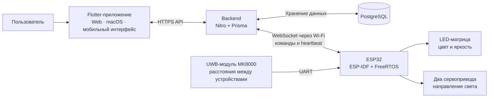
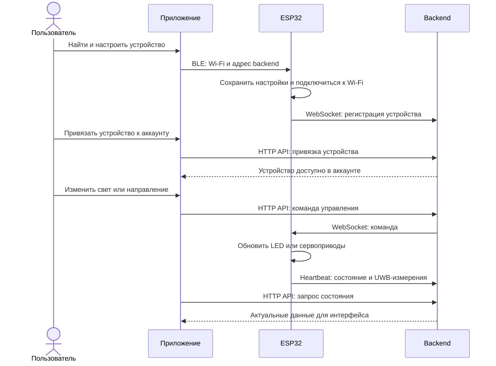

Smart Light — монорепозиторий системы умного освещения с ESP32-устройствами,
UWB-позиционированием, backend на Nitro и мобильным приложением на Flutter.
Система позволяет управлять светодиодами и сервоприводами, объединять устройства
в зоны, сохранять световые сцены и отслеживать взаимное расположение устройств.

## Попробовать Smart Light

> ### 💡 [Открыть приложение → smart-light.tech](https://smart-light.tech/)
>
> Веб-версия Smart Light: познакомьтесь с интерфейсом, создайте аккаунт
> и попробуйте управление своими подключёнными устройствами прямо в браузере.
> Для управления светом и сервоприводами нужна подключённая ESP32.

## Возможности

- авторизация пользователей через регистрацию, вход, refresh-токены и защищенные Bearer-токеном эндпоинты;
- привязка устройств к пользователю, включая claim уже подключенных online-устройств;
- хранение состояния устройств в PostgreSQL через Prisma: сервоприводы, LED, heartbeat и UWB-диагностика;
- UWB-позиционирование: расстояния между устройствами, сглаживание измерений, стабильность сигнала и расчет layout для экрана позиционирования;
- зоны комнаты и световые сцены: можно назначать устройства зонам, сохранять состояние света/сервоприводов и применять сцену обратно к устройствам;
- команда наведения одного устройства на другое по сохраненным координатам/зонам.

## Архитектура

| Компонент | Технологии | Назначение |
|-----------|------------|------------|
| `firmware/` | ESP-IDF, FreeRTOS, C | Управление ESP32, LED, сервоприводами, Wi-Fi, BLE и UWB-модулем |
| `backend/` | Nitro, TypeScript, Prisma, PostgreSQL | API, авторизация, хранение устройств, зон, сцен и данных позиционирования |
| `smart_light/` | Flutter, Dart | Мобильный интерфейс управления устройствами и просмотра UWB-позиционирования |

Устройства передают heartbeat и UWB-измерения на backend через WebSocket.
Мобильное приложение обращается к HTTP API и отображает доступные устройства,
их состояние, зоны, сцены и рассчитанное расположение.

## Структура проекта

```text
smart-light-gpo/
├── backend/       # серверное приложение и Prisma-схема
├── firmware/      # прошивка ESP32 и аппаратные компоненты
├── smart_light/   # Flutter-приложение
└── README.md      # общая документация проекта
```

## Быстрый запуск

Для backend необходимы Node.js, pnpm и доступный PostgreSQL:

```bash
cd backend
cp .env.example .env
pnpm install
pnpm exec prisma generate
pnpm exec prisma migrate deploy
pnpm dev
```

Для мобильного приложения:

```bash
cd smart_light
flutter pub get
flutter run
```

Перед запуском приложения укажите адрес backend в сервисах Flutter. Инструкции
по сборке прошивки и приложения находятся в `firmware/README.md` и
`smart_light/README.md`.

## Запуск Web-версии локально

Для локального запуска нужны PostgreSQL, Node.js с pnpm и Flutter. Сначала создайте базу `smart_light` в PostgreSQL, затем настройте backend:

```powershell
cd backend
Copy-Item .env.example .env
```

В `backend/.env` укажите подключение к PostgreSQL, задайте `EMAIL_CODE_SECRET` и добавьте:

```dotenv
CORS_ALLOWED_ORIGINS=http://localhost:5000
VERIFICATION_DELIVERY=console
```

Затем установите зависимости и запустите backend:

```powershell
pnpm install
pnpm exec prisma generate
pnpm exec prisma migrate deploy
pnpm dev
```

В отдельном терминале из корня репозитория запустите Flutter Web в Chrome:

```powershell
cd smart_light
flutter pub get
flutter run -d chrome --web-port 5000 --dart-define=API_BASE_URL=http://localhost:3000
```

Приложение откроется по адресу `http://localhost:5000`. В режиме `console` коды подтверждения выводятся backend в терминал. Для Web Bluetooth используйте Chrome и localhost.

## API

| Путь | Метод | Назначение |
|------|-------|------------|
| `/` | ANY | Главный эндпоинт |
| `/_ws` | ANY | WebSocket соединение |
| `/health` | GET | Проверка состояния сервиса |
| `/auth/register` | POST | Регистрация пользователя |
| `/auth/login` | POST | Вход и получение access/refresh токенов |
| `/auth/refresh` | POST | Обновление access-токена |
| `/auth/me` | GET | Получить текущего пользователя |
| `/devices` | GET | Получить список устройств текущего пользователя |
| `/devices` | POST | Добавить или привязать устройство |
| `/devices/online` | GET | Получить устройства пользователя, которые сейчас в сети |
| `/devices/claim-online` | POST | Привязать online-устройство к текущему пользователю |
| `/devices/distances` | GET | Получить актуальные UWB-расстояния между устройствами |
| `/devices/distances/summary` | GET | Получить сводку позиционирования с узлами, расстояниями и layout |
| `/devices/distances/mock` | POST | Задать тестовые расстояния для отладки позиционирования |
| `/devices/:id` | GET | Получить устройство по ID |
| `/devices/:id` | PUT | Переименовать устройство |
| `/devices/:id` | DELETE | Отвязать устройство от пользователя |
| `/devices/:id/status` | GET | Получить статус устройства |
| `/devices/:id/led` | POST | Управление светом устройства |
| `/devices/:id/servo` | GET | Получить состояние сервопривода |
| `/devices/:id/servo` | POST | Управление сервоприводами |
| `/devices/:id/zone` | POST | Назначить устройство зоне |
| `/devices/:id/aim` | POST | Навести устройство на другое устройство |
| `/zones` | GET | Получить список зон комнаты |
| `/zones` | POST | Создать или обновить зону |
| `/zones/:id` | DELETE | Удалить зону |
| `/scenes` | GET | Получить список световых сцен |
| `/scenes` | POST | Сохранить новую сцену по текущему состоянию устройств |
| `/scenes/:id` | PUT | Обновить параметры сцены |
| `/scenes/:id` | DELETE | Удалить сцену |
| `/scenes/:id/apply` | POST | Применить сцену к устройствам |
| `/_openapi.json` | ANY | OpenAPI (Swagger) спецификация |
| `/_scalar` | ANY | Scalar UI для просмотра OpenAPI |

Большинство эндпоинтов, кроме `/`, `/_ws`, `/health`, `/auth/register`, `/auth/login`, `/auth/refresh`, `/_openapi.json` и `/_scalar`, требуют заголовок `Authorization: Bearer <accessToken>`.


## Как устроена система

Smart Light объединяет интерфейс управления, сервер и физические светильники.
Пользователь выбирает устройство в приложении, меняет свет или направление,
а backend передаёт команду соответствующей ESP32. Прошивка управляет
LED-матрицей и двумя сервоприводами, которые меняют направление светильника.

Основной путь управления проходит через интернет: приложение обращается
к HTTP API, а ESP32 поддерживает WebSocket-соединение с сервером по Wi-Fi.
По этому соединению устройство получает команды и отправляет heartbeat
со своим состоянием и данными UWB. PostgreSQL хранит пользователей,
устройства, зоны и сохранённые световые сцены.


```mermaid
flowchart LR
    User["Пользователь"] --> App["Flutter-приложение<br/>Web · macOS · мобильный интерфейс"]
    App <-->|"HTTPS API"| Backend["Backend<br/>Nitro + Prisma"]
    Backend <-->|"Хранение данных"| DB[("PostgreSQL")]
    Backend <-->|"WebSocket через Wi-Fi<br/>команды и heartbeat"| ESP["ESP32<br/>ESP-IDF + FreeRTOS"]
    ESP --> LED["LED-матрица<br/>цвет и яркость"]
    ESP --> Servo["Два сервопривода<br/>направление света"]
    UWB["UWB-модуль MK8000<br/>расстояния между устройствами"] -->|"UART"| ESP
```

### Первое подключение и управление

1. Пользователь входит в аккаунт и запускает поиск устройства через BLE.
2. Приложение передаёт ESP32 параметры Wi-Fi и адрес backend.
3. ESP32 сохраняет настройки, подключается к Wi-Fi и устанавливает
   WebSocket-соединение с сервером.
4. Устройство привязывается к аккаунту и становится доступным для управления.
5. Пользователь меняет цвет, яркость или угол сервопривода; команда проходит
   через backend к устройству. Его состояние обновляется через heartbeat.

BLE используется для первоначальной настройки. После подключения
обычное управление идёт через сервер по Wi-Fi.


```mermaid
sequenceDiagram
    actor User as Пользователь
    participant App as Приложение
    participant ESP as ESP32
    participant API as Backend
    User->>App: Найти и настроить устройство
    App->>ESP: BLE: Wi-Fi и адрес backend
    ESP->>ESP: Сохранить настройки и подключиться к Wi-Fi
    ESP->>API: WebSocket: регистрация устройства
    User->>App: Привязать устройство к аккаунту
    App->>API: HTTP API: привязка устройства
    API-->>App: Устройство доступно в аккаунте
    User->>App: Изменить свет или направление
    App->>API: HTTP API: команда управления
    API->>ESP: WebSocket: команда
    ESP->>ESP: Обновить LED или сервоприводы
    ESP->>API: Heartbeat: состояние и UWB-измерения
    App->>API: HTTP API: запрос состояния
    API-->>App: Актуальные данные для интерфейса
```

## UWB и пространственная логика

UWB (Ultra-Wideband) используется для измерения расстояний между устройствами.
В аппаратной части за это отвечает модуль MK8000: ESP32 получает его измерения
через UART и передаёт их на сервер вместе с heartbeat. Backend обрабатывает
расстояния, сглаживает изменения и подготавливает данные для экрана
позиционирования.

Задумка — связать управление светом с расположением устройств в комнате.
Расстояния помогают представить их взаимное расположение, а зоны позволяют
связать устройства с участками помещения. Для команды наведения backend
использует сохранённые координаты и высоту устройств, рассчитывает углы
и отправляет команды двум сервоприводам.

### Зоны и световые сцены

**Зона** объединяет устройства по месту или назначению: например, рабочий стол,
зона отдыха или отдельная часть комнаты. **Сцена** сохраняет сочетание параметров
света и положений сервоприводов для выбранных устройств. При применении сцены
backend отправляет соответствующие команды подключённым ESP32.

Таким образом, ручное управление подходит для настройки отдельного светильника,
а сцены — для повторного применения нужного освещения сразу к группе устройств.

## Приложение с облачным backend

[Веб-приложение](https://smart-light.tech/) и локальная сборка Flutter могут
использовать один облачный backend. В `smart_light/lib/services/api_config.dart`
адрес API по умолчанию — `https://api.smart-light.tech`; WebSocket-адрес
для настройки устройства формируется как `wss://api.smart-light.tech/_ws`.

Для запуска локального приложения macOS с облачным API:

```bash
cd smart_light
flutter pub get
flutter run -d macos --dart-define=API_BASE_URL=https://api.smart-light.tech
```

При таком запуске локальные backend и PostgreSQL не нужны.
Параметр `API_BASE_URL` позволяет выбрать сервер без редактирования сервисов
Flutter; вариант с полностью локальным backend описан выше.
